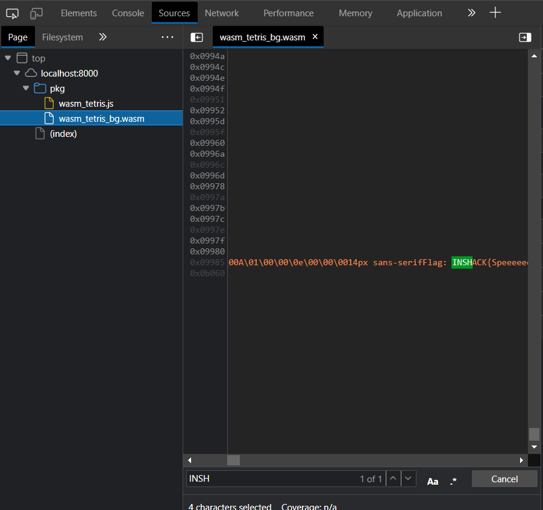
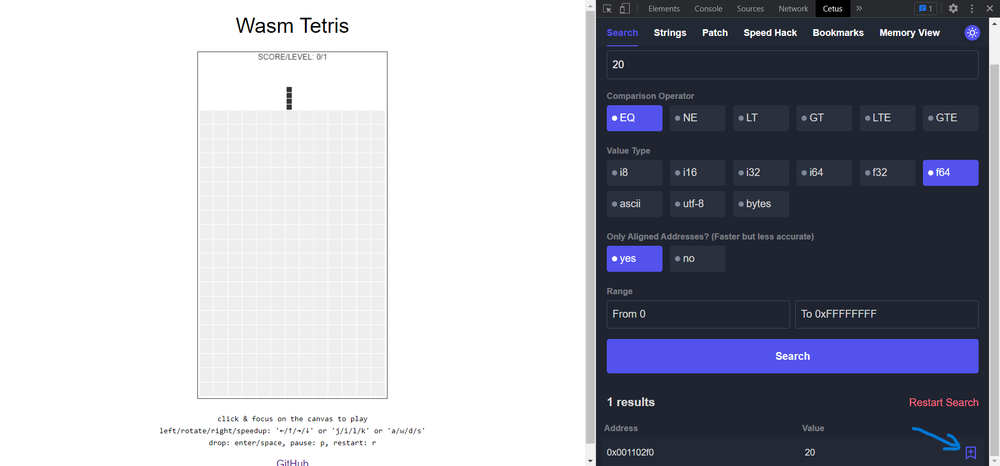
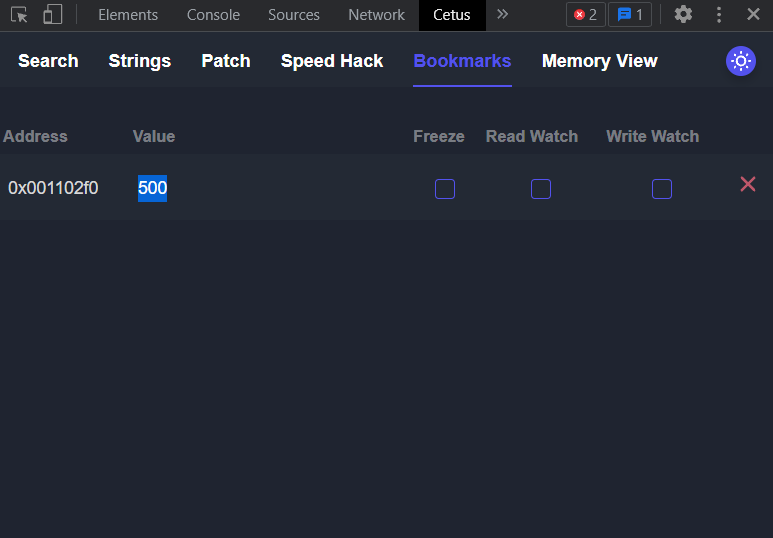

# Speeeeed writeup
Author: Louis KUSNO

## Introduction

The goal of the challenge was to be able to look into the memory of a web assembly program (and play some tetris).

To do this we need the use of the browser extention `Cetus` (download [here](https://github.com/Qwokka/Cetus) and add it to your browsers extentions).

This challenge was inspired by the [advent of cyber 2022](https://tryhackme.com/room/adventofcyber4) day 10 challenge `Hack a Game`. A walkthrough of that challenge can be found [here](https://www.youtube.com/watch?v=_ej3yMF31zg).

## The challenge 

As I found out on the day of the CTF there were actually two ways to get the flag.

### What people did

The flag was not obfuscated in the web assembly code, so it was possible to just search for the flag in its strings. So what you needed to do was:

- Inspect the source code
- Go to `Sources`
- Find the `.wasm` file (located in `pkg` folder)
- Ctrl + F for `INSHACK`

### The inteded method

The intended method was to use the `Cetus` extention to look into the memory of the web assembly program.

There was a hint in the head of the html code saying speed is 20 and its type is a float 64.

By searching for 20 as a float 64 we find one result. Then bookmark it by clicking on the icon at the far right of the row (indicated by the blue arrow).

In the bookmarks tab increase its value (500 works well for me) to reduce its speed.

The play tetris until you get 500 points and the flag should appear on the screen.

Note: you can play until you get one line and then search for 100 as a float 64 to get the address for the points variable and change it to something greater than 500.
